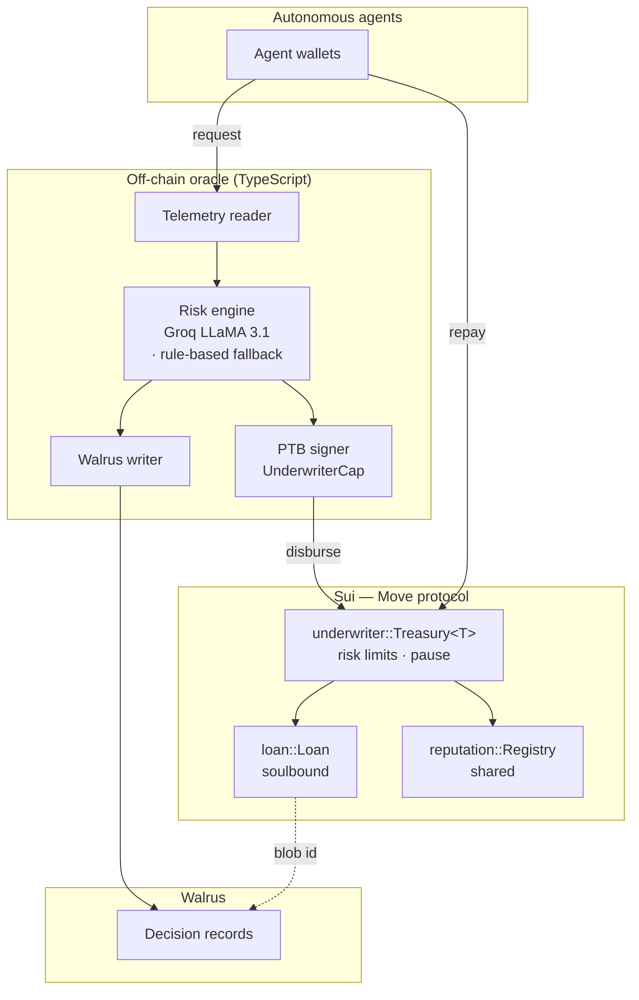

# M-Fi — Machine Finance

**An autonomous, on-chain credit protocol for AI agents, built on Sui.**

M-Fi underwrites and disburses micro-loans to autonomous software agents in real time. An LLM scores each request against the borrower's live on-chain history, records the full decision to [Walrus](https://walrus.xyz) for permanent auditability, and settles the loan in a single Sui programmable transaction. Repayment builds an on-chain reputation that governs future credit. There is no human in the loop, and no identity required — creditworthiness is derived entirely from behavior.

Built for **Sui Overflow 2026** — _Agentic Web_ and _Walrus_ tracks.

**Live dApp:** [mfi-sui.vercel.app](https://mfi-sui.vercel.app) · the same build is also stored on Walrus as a [Walrus Site](https://testnet.suivision.xyz/object/0x44f88c13744fd6a157a5e3040c3fc8cdd589d0a4b65dc7cedddfebfd42a87d25).

- **Live package (testnet):** [`0x8b75ef9a…818036`](https://testnet.suivision.xyz/package/0x8b75ef9aa4c20c03207e2b3821038240f8e17d48e3b0cc6b58c43c6bde818036)

---

## Motivation

Autonomous agents increasingly perform paid economic work — trading, data collection, oracle maintenance, on-chain automation — yet they can only ever spend the capital they already hold. Conventional credit is inaccessible to them: it assumes a legal identity, KYC, a credit history, and human approval on a human timescale.

M-Fi provides the missing primitive: a credit facility designed for software. It approves in seconds rather than days, judges borrowers on verifiable on-chain behavior rather than identity, and makes every automated lending decision independently auditable.

---

## How it works

A loan moves through six fully automated steps:

1. **Telemetry** — the oracle reads the borrower's on-chain state: SUI and USDC balances, account age, transaction count, and owned objects.
2. **Underwriting** — an LLM (Groq, LLaMA 3.1) returns a decision — `APPROVE`, `DENY`, or `COUNTER_OFFER` — and a trust score (0–1000). A deterministic rule-based engine is used when no model key is configured.
3. **Attestation** — the complete decision record (model reasoning plus the exact telemetry it evaluated) is written to Walrus; the resulting blob ID is the audit trail.
4. **Disbursement** — a single programmable transaction takes USDC from the shared treasury, transfers it to the borrower, mints a soulbound `Loan` object carrying the Walrus blob ID, updates the borrower's reputation, and emits an event.
5. **Repayment** — the agent repays from its own wallet; the principal returns to the treasury.
6. **Reputation** — a clean repayment raises the agent's on-chain trust score, expanding its future credit.

---

## Architecture



The frontend reads protocol state directly from the chain (`queryEvents`, `getObject`) and fetches decision records from Walrus, so the dashboard reflects real on-chain activity with no backend of its own.

---

## On-chain protocol

The Move package ([`mfi/sources`](./mfi/sources)) comprises four modules:

| Module | Responsibility |
| --- | --- |
| `underwriter` | Shared `Treasury<T>`; capability-gated `disburse` and `repay`; on-chain risk limits and circuit breaker |
| `loan` | The soulbound `Loan` object — non-transferable, holds the Walrus decision-blob ID and loan terms |
| `reputation` | Shared `ReputationRegistry`; trust scores updated on every disbursement and repayment |
| `mock_usdc` | Testnet stablecoin used for the demo; `Treasury<T>` is generic, so mainnet uses native USDC unchanged |

### Risk and access controls

The protocol constrains the operator rather than trusting it. All controls are enforced in Move and covered by tests:

- **Exposure limits.** Every disbursement is bounded by a per-loan cap (`max_loan`), a minimum trust threshold (`min_trust`), and a global outstanding-debt ceiling (`max_outstanding`). A compromised operator key cannot exceed these limits, so worst-case loss is bounded by a value set on-chain.
- **Repayment integrity.** A loan cannot be closed for less than its principal.
- **Circuit breaker.** A `paused` flag halts all disbursement in a single transaction.
- **Separation of privilege.** A cold `AdminCap` (parameters, pause, treasury creation) is distinct from a hot `UnderwriterCap` (disbursement only). The always-online key cannot change parameters or unpause.

```bash
cd mfi && sui move test    # 7 / 7 passing
```

---

## Repository structure

```
mfi-sui/
├── mfi/                 Move package — the on-chain protocol
│   ├── sources/         underwriter · loan · reputation · mock_usdc
│   └── tests/           unit and scenario tests
├── oracle/              Off-chain services (TypeScript, @mysten/sui)
│   └── src/
│       ├── telemetry.ts     on-chain history reader
│       ├── risk-engine.ts   LLM underwriting (Groq)
│       ├── walrus.ts        decision storage / retrieval
│       ├── ptb.ts           disbursement transaction builder
│       ├── server.ts        HTTP API
│       └── agents.ts        autonomous agent loop
└── web/                 Next.js frontend
    ├── app/             "/" landing  ·  "/app" live dashboard
    ├── components/
    └── lib/             chain reads · live data hooks · config
```

---

## Deployment (Sui testnet)

| Object | ID |
| --- | --- |
| Package | [`0x8b75ef9a…818036`](https://testnet.suivision.xyz/package/0x8b75ef9aa4c20c03207e2b3821038240f8e17d48e3b0cc6b58c43c6bde818036) |
| `Treasury<MOCK_USDC>` | [`0x1a52d0fd…986983`](https://testnet.suivision.xyz/object/0x1a52d0fd2da9078ebeb2b12c562cdb50964ddd9c3332b1424ec7378f46986983) |
| `ReputationRegistry` | [`0xc8702324…3e20a8`](https://testnet.suivision.xyz/object/0xc870232497611777ba48d29842f320eba3555caec4b9754100f9d9daf83e20a8) |
| Reports package (`mfi_reports`) | [`0x8bbb42dd…991045`](https://testnet.suivision.xyz/package/0x8bbb42ddd316638e363e998ec7db8f6dbdffebc1cdc08f9707d6e2377a991045) |
| `ReportRegistry` | [`0x053f4aad…ce2170`](https://testnet.suivision.xyz/object/0x053f4aad29b6af9609b9add5a4d64da032cc668d0214a56150a1291151ce2170) |
| Walrus Site (the dApp itself) | [`0x44f88c13…a87d25`](https://testnet.suivision.xyz/object/0x44f88c13744fd6a157a5e3040c3fc8cdd589d0a4b65dc7cedddfebfd42a87d25) |
| Verifier package (`mfi_verifier`) | [`0xfb8d17ec…22b3cca`](https://testnet.suivision.xyz/package/0xfb8d17ec872e9d7774f6aa656e8ef05b53064cf69beeec0f031c05fd422b3cca) |
| `EnclaveConfig` (attested-decision verifier) | [`0xc597fd6e…1ce61d`](https://testnet.suivision.xyz/object/0xc597fd6e12f145e46f3f80ebb1391b6698ca8f834bb414c7698202198e1ce61d) |

A `MOCK_USDC` token is used because Sui testnet lacks deep stablecoin liquidity. Because the treasury is generic over its coin type, a mainnet deployment parameterizes it with native USDC without code changes.

**Testnet economics, stated plainly:** there is no real economy on testnet, so demo agents' "job revenue" (the interest they repay above principal) is minted by the oracle. The protocol accounting — share-price appreciation, depositor yield, repayment tracking — is identical when revenue is real; only the source of the agents' income is simulated. On mainnet, agents repay from actual earnings, and the underwriter's loss capital absorbs defaults.

**Defaults are part of the demo.** One agent (`agent-66-rogue`) takes a starter loan and never repays. Its loan stays `ACTIVE` on-chain, its registry record shows the unpaid book, and the underwriter's deterministic credit check — which reads the on-chain `ReputationRegistry` before every decision, ahead of the model — denies it all future credit. Each denial is also sealed to Walrus, so the consequence side of the credit system is as auditable as the approvals.

---

## Local development

**Prerequisites:** Node.js 18+, the [Sui CLI](https://docs.sui.io/guides/developer/getting-started/sui-install), and a funded testnet address.

```bash
# Contracts — build and test
cd mfi
sui move test

# Oracle and autonomous agents
cd ../oracle
npm install
cp .env.example .env          # set object IDs and, optionally, GROQ_API_KEY
npm run agents                # agents borrow and repay autonomously, on-chain
npm start                     # alternatively, run the HTTP API

# Frontend
cd ../web
npm install
npm run dev                   # http://localhost:3000
```

The agent loop runs without an LLM key by falling back to the rule-based underwriter. Provide `GROQ_API_KEY` to enable model-based underwriting and live Walrus attestation.

---

## Technology

| Layer | Stack |
| --- | --- |
| Smart contracts | Sui Move (2024 edition) |
| Verifiable storage | Walrus — decision records stored and referenced on-chain |
| Underwriting | Groq (LLaMA 3.1 8B), with a deterministic rule-based fallback |
| Frontend | Next.js 14, `@mysten/dapp-kit`, Tailwind CSS, GSAP, Framer Motion |
| On-chain data | `@mysten/sui`, TanStack Query (`queryEvents`, `getObject`) |

---

## Track alignment

- **Agentic Web.** A credit primitive for autonomous agents — machine-speed, identity-free, behavior-based lending that agents execute end to end.
- **Walrus.** Walrus is load-bearing in three dimensions:
  1. **Verifiable decisions** — every underwriting decision (model reasoning + the exact telemetry evaluated) is Ed25519-signed by the underwriter key, sealed on Walrus, and pinned to the on-chain `Loan`. The dashboard verifies all three properties live in the browser: content-addressed availability, signature, and agreement with on-chain terms.
  2. **Credit reports as a product** — the bureau periodically issues each agent a signed credit report on Walrus (trust trajectory, full loan history, evidence links to every decision blob), discoverable via the on-chain `ReportRegistry`. An agent's creditworthiness is a portable, independently verifiable document any protocol can consume.
  3. **The site itself** — the frontend is deployed as a Walrus Site (object `0x44f88c13…a87d25`); the interface judging the protocol is served from the same storage that proves it. Testnet sites are browsed via a [self-hosted portal](https://docs.wal.app/walrus-sites/portal.html) (the public `wal.app` portal serves mainnet only).

  An LLM underwriter that depositors can't audit is a black box; with Walrus, every dollar disbursed carries an immutable, independently fetchable explanation. Without it, this product does not exist. At production volume, decision blobs batch via [Quilt](https://docs.wal.app), cutting small-blob storage costs by ~100×.

---

## Verifiable AI: compute + storage + settlement

Walrus proves *what* the underwriter decided. The harder question is *was the decision computed honestly* — today it runs on a server you must trust. M-Fi closes that with a three-layer verifiability stack, all Sui-native:

| Layer | Primitive | Guarantee |
| --- | --- | --- |
| **Compute** | [Sui Nautilus](https://docs.sui.io/concepts/cryptography/nautilus) (TEE attestation) | the risk model ran *unmodified* in an attested enclave |
| **Storage** | Walrus | the decision + telemetry are immutable and independently fetchable |
| **Settlement** | Sui Move | the loan only exists if both checks pass on-chain |

The on-chain verification half is **live and tested** today: [`mfi_verifier::enclave`](mfi-verifier/sources/enclave.move) registers the attested enclave's signing key and verifies the enclave's Ed25519 signature over each decision before it is accepted (real `sui::ed25519` math, 3/3 unit tests, a `DecisionVerified` event already emitted on testnet). The remaining step — running the LLM inside an [AWS Nitro enclave and registering its attestation document](https://blog.sui.io/nautilus-offchain-security-privacy-web3/) (custom PCR verification has been live on Sui mainnet since Feb 2026) — is the integration on the roadmap. The contract that checks it is already deployed.

---

## Built for Sui's realities

Sui is fast and parallel, but it has sharp edges we designed around rather than ignored:

- **Liveness.** Sui has had real mainnet interruptions (a January 2026 consensus halt; [three outages inside 48 hours in late May 2026](https://www.coindesk.com/tech/2026/05/28/sui-blockchain-suffers-another-network-outage-as-transactions-grind-to-a-halt)). An always-on autonomous agent loop cannot assume the chain is always reachable, so the oracle wraps every RPC and Walrus call in exponential-backoff retry and recovers a dropped cycle instead of crashing.
- **Shared-object congestion.** Writes to the same shared object execute sequentially — the constraint behind Sui's own [congestion-control work](https://blog.sui.io/shared-object-congestion-control/). Every loan currently mutates one shared `Treasury`, which is fine at demo volume but is the first thing to shard at scale: per-risk-tier treasuries (independent shared objects) remove the single write-contention point, and reads (`total_assets`) stay cheap. The accounting is already generic over the treasury, so sharding is additive, not a rewrite.

## Roadmap

The protocol is feature-complete on testnet. Remaining work toward a production deployment, in priority order:

- **Nautilus underwriting** — run the LLM risk engine in an AWS Nitro enclave and register its attestation; the on-chain verifier ([`mfi_verifier`](mfi-verifier/sources/enclave.move)) is already deployed, making the underwriter trustless rather than trusted.
- **Private credit reports via [Seal](https://docs.sui.io)** — threshold-encrypt reports on Walrus with on-chain access policies, so an agent's history is portable *and* confidential (decryptable only by the agent and approved lenders).
- **Gasless, wallet-free UX via [Enoki](https://docs.enoki.mystenlabs.com/)** — zkLogin onboarding (sign in with Google) and a sponsored-transaction gas pool, which also replaces the underwriter's manual gas funding with production-grade sponsorship.
- **Treasury sharding** — per-risk-tier shared objects to eliminate write contention (see above).
- Yield routing for idle capital (Scallop) with just-in-time withdrawal; a collateral model; `AdminCap` in a multisig and `UnderwriterCap` in a KMS; independent security audit before holding real funds.

The on-chain exposure ceiling makes a bounded mainnet pilot feasible ahead of these, with maximum loss capped by an on-chain parameter.

---

## License

MIT
